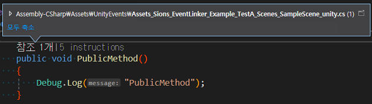

# Sions.EventLinker

UnityEvent, SendMessage, Animation Event처럼 “문자열 기반 호출”을 프로젝트 전역에서 모아 확인하고, 안전하게 관리할 수 있도록 C# 호출로 연결해 주는 Unity Editor 확장 패키지입니다. Inspector에서 배치하는 UnityEvent나 애니메이션 이벤트처럼 누락되기 쉬운 지점을 스캔해 코드로 드러내고, IDE 지원(IntelliSense, Go to Definition, 리팩터링)을 그대로 활용할 수 있게 합니다.

## 사용처

- 문자열 의존 제거: `SendMessage("OnFire")` 같은 호출을 실제 메서드 호출로 바꿔 Rename에도 안전합니다.
- IDE 친화적 작업: 생성된 C#에 원본 경로/위치가 주석으로 남고, 타깃 메서드를 직접 호출하므로 탐색과 리팩터링이 수월합니다.
- 상태를 한눈에: 씬·프리팹·애니메이션·애니메이터·스크립터블오브젝트·C# 스크립트를 한 번에 훑어 이벤트 연결 상황을 점검할 수 있습니다.
- 리뷰/이력에 강함: “보이지 않던 Inspector 설정”을 코드로 바꿔 리뷰와 변경 추적이 쉬워집니다.

**[샘플 코드](Sions.EventLinker.Sample/Assets/UnityEvents)를 보고싶다면 클릭하세요**


## 어떻게 동작하나요

1) 자산 스캔: Scenes, Prefabs, Animation Clips/Animator Controllers, ScriptableObjects, C# 스크립트(내의 SendMessage)를 찾습니다.

2) 이벤트 분석:
- UnityEvent: `SerializedObject/Property` 순회로 영속 호출(Persistent Call)을 수집합니다.
- Animation Event: 클립 이벤트 함수명을 리플렉션(reflection)으로 메서드 시그니처(signature)에 매칭합니다.
- SendMessage: 정규식 기반 정적 분석으로 함수명을 추출하고, 가능한 시그니처를 인덱싱(indexing)합니다.

3) 코드 생성: 각 원본 파일(특정 씬/프리팹 등)마다 1개의 C# 클래스를 만들고, “그 파일 안의 각 이벤트”를 하나의 타입-세이프(type-safe) 메서드로 래핑합니다. 네임스페이스는 `SionsEventLink.Runtime`입니다. 메서드 위에는 원본 위치(디렉터리/파일/계층/프로퍼티, 또는 클립/시간)를 주석으로 남깁니다.

4) 활용: 생성 코드는 “참조 가능한 인덱스이자 안전한 호출 경로”입니다. 어디서 무엇을 호출하는지 IDE에서 즉시 확인하고, 이름/시그니처 변경 시 컴파일 타임에 문제를 잡아낼 수 있습니다.

## 예시

아래는 실제 생성물과 유사한 형태입니다. 주석은 원본 위치를, 본문은 강타입 메서드 호출을 보여줍니다.

### UnityEvent 버튼 클릭

어떤 오브젝트의 어떤 UnityEvent가 실제로 어떤 메서드를 호출하는지가 코드로 남습니다. Rename에도 컴파일 타임에 바로 검출됩니다.





### SendMessage 문자열 호출

문자열 기반 호출을 실제 메서드로 바인딩(binding)합니다. 기존 코드를 바로 바꾸지 않아도, “어디서 무엇을 부르는지”를 코드로 추적할 수 있어 리팩터링 위험도가 줄어듭니다.


### Animation Event(클립 타임라인)

클립 이벤트가 코드로 연결되므로, 대상 메서드의 인자 변경(예: `string`→`float`)도 즉시 컴파일 오류로 확인됩니다.

```csharp
namespace SionsEventLink.Runtime
{
    [UnityEngine.Scripting.Preserve]
    public class Assets_Sample_Animation_Run_anim
    {
        /// CLIP : Run(123456)
        /// TIME : 0.5000s
        public void Run_123456_0_5000(PlayerEffects target)
            => target.Footstep();
    }
}
```

## 설치방법

- PackageManager를 통해서 `Sions.EventLinker/package.json`을 가져오세요.
  - 레포를 다운받은 뒤, disk로 가져오기
  - `Sions.EventLinker`를 프로젝트 `packages` 폴더에 넣기
  - github 주소를 사용하기
  
## 사용방법
- Project Settings > Sions > Event Link Generator에서 스캔 대상과 출력 폴더를 지정합니다.
  - IncludeScene/Prefab/Animation/Animator/ScriptableObject/SendMessage: 스캔 범위 선택
  - GenerateFolder: 생성 코드 저장 위치(기본 `Assets/UnityEvents`)
  - ClearBeforeGeneration: 생성 전 폴더 초기화
  - LinkingOnEditorStartup: 에디터 시작 시 자동 생성
  - IncludeMissing / IncludeInaccessible: 누락/비공개 대상도 코드에 반영(점검 목적, 컴파일 오류가 날 수 있음)
- Generate 버튼을 누르면 스캔 → 분석 → 생성이 순서대로 실행됩니다.

## 한계와 주의사항

- 점검 옵션: `IncludeMissing`/`IncludeInaccessible` 사용 시 의도적으로 컴파일 오류가 발생할 수 있습니다. 잘못 연결된 이벤트를 조기에 드러내기 위한 용도입니다.
- 패키지 자산: 씬 스캔은 로컬/임베디드 패키지만 대상으로 합니다(원격 패키지 제외).
- Animation Event 인자: 무인자 또는 `float/int/string/UnityEngine.Object` 범위를 우선 지원합니다.
- SendMessage 분석: 0~1개 인자 시그니처에 맞춰 가장 합리적인 메서드를 선택합니다.

## 구성 요소

- Processors: 자산을 찾고 여는 단계(Scene/Prefab/Animation/Animator/ScriptableObject/SendMessage, 마지막에 Save).
- Solvers: 대상에서 이벤트를 추출(SerializedProperty 순회, Reflection 기반 메서드 탐색 등).
- EventEntries: 발견된 이벤트를 공통 구조로 보관하고 코드 생성에 사용.
- SaveProcessor: 원본 파일 경로별로 1개 C# 파일을 만들고, 이벤트 위치를 주석으로 기록한 래핑 메서드를 생성.

## 작업내용

- UnityEditor API: `AssetDatabase`, `EditorSceneManager`(Additive 로드/언로드), `SettingsProvider` UI, `PackageManager.Client.List`
- 직렬화 접근: `SerializedObject/Property` 기반으로 UnityEvent Persistent Call 안정 수집
- Reflection/CodeGen: 강타입 매칭, 안전한 식별자/네임스페이스/클래스 설계
- 파이프라인: Processor/Solver/EventEntry/SaveProcessor로 나눈 확장 가능한 단계화 구조, 취소 가능한 진행 UI

## 프로젝트 상태

- Unity 2022.3+ 타깃, 패키지 버전 1.0.0
- 샘플 포함: `Sions.EventLinker.Sample`에 테스트용 씬/프리팹/애니메이션 포함

결론적으로, Sions.EventLinker는 “프로젝트 전역의 이벤트 배선을 코드로 가시화하고, 타입-세이프하게 연결”해 주는 도구입니다. 프로젝트가 커질수록 효과가 커지며, 팀의 리뷰/리팩터링 과정에서 안정성을 높여줍니다.
